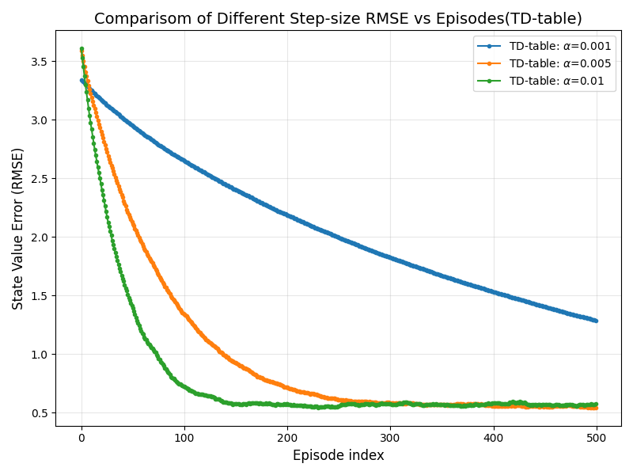
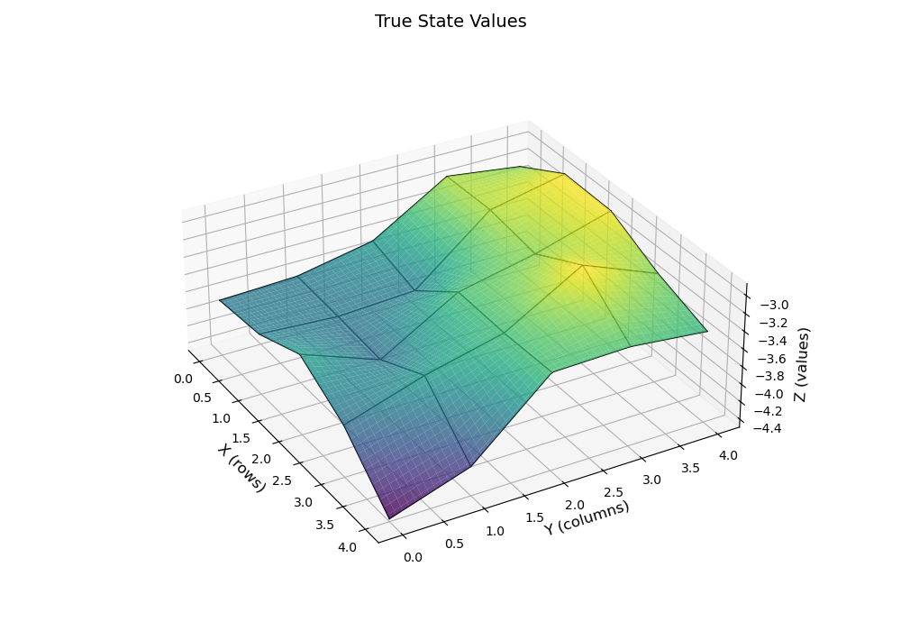
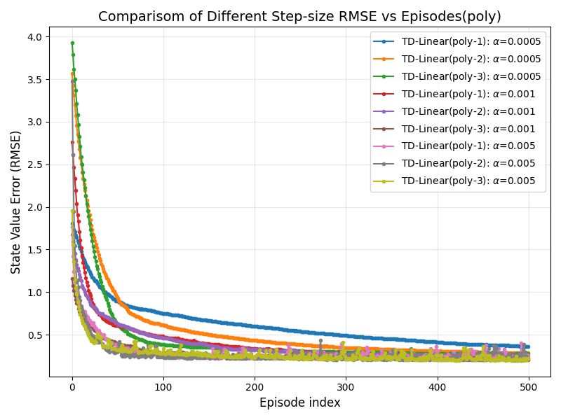
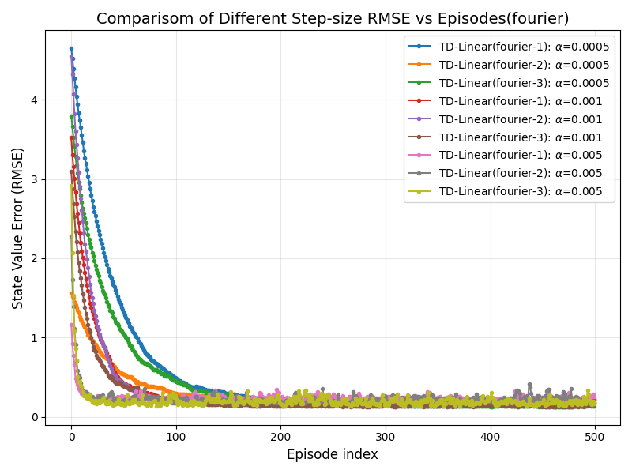
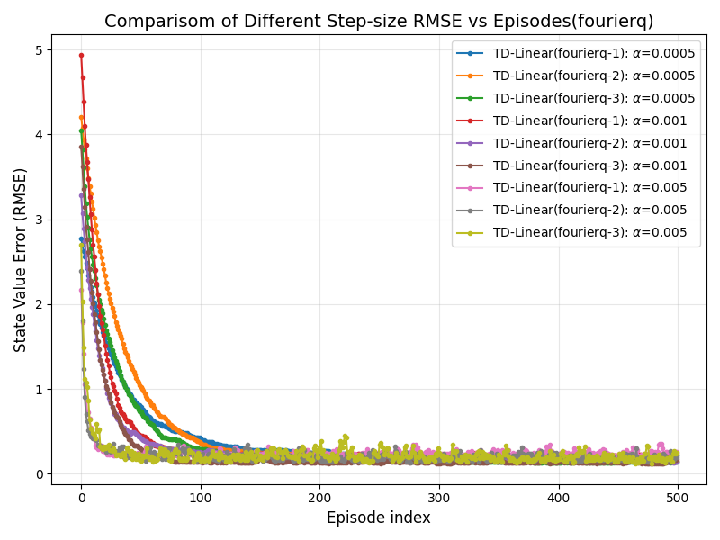

# Results

## TD-Table

<div align=center>
    
    <p>Figure 2: Comparison of Different Step-size RMSE vs Episodes(TD-table)</p>
</div>

| Model | $\alpha$ | RMSE | Episode | Time | Speed(it/s) |
|:-------:|:-------:|:-------:|:-------:|:-------:|:-------:|
| TD-Table | 0.001 | 1.29 | 499 | 6s | 36796.43 |
| TD-Table | 0.005 | **0.543** | 499 | 6s | **37208.28** |
| TD-Table | 0.01 | 0.572 | 499 | 6s | 37126.31 |

| Ground Truth | $\alpha=0.001$ | $\alpha=0.005$ | $\alpha=0.01$ |
|:-------:|:-------:|:-------:|:-------:|
|  |.png) | .png) | .png) |

## Polynomial Basis TD-Linear

<div align=center>
    
    <p>Figure 3: Comparison of Different Step-size RMSE vs Episodes(poly)</p>
</div>

| Model | $\alpha$ | RMSE | Episode | Time | Speed(it/s) |
|:-------:|:-------:|:-------:|:-------:|:-------:|:-------:|
| TD-Linear(poly-1) | 0.0005 | 0.362 | 499 | 20s | 12323.20 |
| TD-Linear(poly-2) | 0.0005 | 0.287 | 499 | 25s | 9914.35 |
| TD-Linear(poly-3) | 0.0005 | 0.274 | 499 | 34s | 7270.93 |
| TD-Linear(poly-1) | 0.001 | 0.232 | 499 | 20s | 12373.62 |
| TD-Linear(poly-2) | 0.001 | 0.251 | 499 | 25s | 9975.56 |
| TD-Linear(poly-3) | 0.001 | **0.205** | 499 | 34s | 7290.25 |
| TD-Linear(poly-1) | 0.005 | 0.251 | 499 | **19s** | **12544.32** |
| TD-Linear(poly-2) | 0.005 | 0.22 | 499 | 25s | 9977.94 |
| TD-Linear(poly-3) | 0.005 | 0.218 | 499 | 34s | 7285.76 |

| Model | $\alpha=0.0005$ | $\alpha=0.001$ | $\alpha=0.005$ |
|:-------:|:-------:|:-------:|:-------:|
| poly-1 | .png) | .png) | .png) |
| poly-2 | .png) | .png) | .png) |
| poly-3 | .png) | .png) | .png) |

## Fourier Basis TD-Linear

### fourier

<div align=center>
    
    <p>Figure 4: Comparison of Different Step-size RMSE vs Episodes(fourier)</p>
</div>

| Model | $\alpha$ | RMSE | Episode | Time | Speed(it/s) |
|:-------:|:-------:|:-------:|:-------:|:-------:|:-------:|
| TD-Linear(fourier-1) | 0.0005 | 0.224 | 499 | **24s** | 10261.67 |
| TD-Linear(fourier-2) | 0.0005 | 0.174 | 499 | 35s | 7064.83 |
| TD-Linear(fourier-3) | 0.0005 | **0.14** | 499 | 49s | 5000.98 |
| TD-Linear(fourier-1) | 0.001 | 0.216 | 499 | **24s** | **10354.61** |
| TD-Linear(fourier-2) | 0.001 | 0.171 | 499 | 35s | 7050.23 |
| TD-Linear(fourier-3) | 0.001 | 0.164 | 499 | 50s | 4983.91 |
| TD-Linear(fourier-1) | 0.005 | 0.253 | 499 | **24s** | 10313.69 |
| TD-Linear(fourier-2) | 0.005 | 0.183 | 499 | 35s | 7036.32 |
| TD-Linear(fourier-3) | 0.005 | 0.166 | 499 | 53s | 4629.79 |


| Model | $\alpha=0.0005$ | $\alpha=0.001$ | $\alpha=0.005$ |
|:-------:|:-------:|:-------:|:-------:|
| fourier-1 | .png) | .png) | .png) |
| fourier-2 | .png) | .png) | .png) |
| fourier-3 | .png) | .png) | .png) |

### fourierq

<div align=center>
    
    <p>Figure 5: Comparison of Different Step-size RMSE vs Episodes(fourierq)</p>
</div>

| Model | $\alpha$ | RMSE | Episode | Time | Speed(it/s) |
|:-------:|:-------:|:-------:|:-------:|:-------:|:-------:|
| TD-Linear(fourierq-1) | 0.0005 | 0.212 | 499 | **28s** | **8662.23** |
| TD-Linear(fourierq-2) | 0.0005 | 0.149 | 499 | 47s | 5314.77 |
| TD-Linear(fourierq-3) | 0.0005 | **0.138** | 499 | 75s | 3291.93 |
| TD-Linear(fourierq-1) | 0.001 | 0.227 | 499 | 29s | 8617.28 |
| TD-Linear(fourierq-2) | 0.001 | **0.138** | 499 | 47s | 5281.71 |
| TD-Linear(fourierq-3) | 0.001 | 0.172 | 499 | 71s | 3483.49 |
| TD-Linear(fourierq-1) | 0.005 | 0.255 | 499 | **28s** | 8649.40 |
| TD-Linear(fourierq-2) | 0.005 | 0.199 | 499 | 47s | 5282.37 |
| TD-Linear(fourierq-3) | 0.005 | 0.246 | 499 | 72s | 3449.88 |


| Model | $\alpha=0.0005$ | $\alpha=0.001$ | $\alpha=0.005$ |
|:-------:|:-------:|:-------:|:-------:|
| fourierq-1 | .png) | .png) | .png) |
| fourierq-2 | .png) | .png) | .png) |
| fourierq-3 | .png) | .png) | .png) |


## Summary

| Model | $\alpha$ | RMSE | Episode | Time | Speed(it/s) |
|:-------:|:-------:|:-------:|:-------:|:-------:|:-------:|
| TD-Table | 0.001 | 1.29 | 499 | 6s | 36796.43 |
| TD-Table | 0.005 | 0.543 | 499 | 6s | 37208.28 |
| TD-Table | 0.01 | 0.572 | 499 | 6s | 37126.31 |
| TD-Linear(poly-1) | 0.0005 | 0.362 | 499 | 20s | 12323.20 |
| TD-Linear(poly-2) | 0.0005 | 0.287 | 499 | 25s | 9914.35 |
| TD-Linear(poly-3) | 0.0005 | 0.274 | 499 | 34s | 7270.93 |
| TD-Linear(fourier-1) | 0.0005 | 0.224 | 499 | 24s | 10261.67 |
| TD-Linear(fourier-2) | 0.0005 | 0.174 | 499 | 35s | 7064.83 |
| TD-Linear(fourier-3) | 0.0005 | 0.14 | 499 | 49s | 5000.98 |
| TD-Linear(fourierq-1) | 0.0005 | 0.212 | 499 | 28s | 8662.23 |
| TD-Linear(fourierq-2) | 0.0005 | 0.149 | 499 | 47s | 5314.77 |
| TD-Linear(fourierq-3) | 0.0005 | **0.138** | 499 | 75s | 3291.93 |
| TD-Linear(poly-1) | 0.001 | 0.232 | 499 | 20s | 12373.62 |
| TD-Linear(poly-2) | 0.001 | 0.251 | 499 | 25s | 9975.56 |
| TD-Linear(poly-3) | 0.001 | 0.205 | 499 | 34s | 7290.25 |
| TD-Linear(fourier-1) | 0.001 | 0.216 | 499 | 24s | 10354.61 |
| TD-Linear(fourier-2) | 0.001 | 0.171 | 499 | 35s | 7050.23 |
| TD-Linear(fourier-3) | 0.001 | 0.164 | 499 | 50s | 4983.91 |
| TD-Linear(fourierq-1) | 0.001 | 0.227 | 499 | 29s | 8617.28 |
| TD-Linear(fourierq-2) | 0.001 | **0.138** | 499 | 47s | 5281.71 |
| TD-Linear(fourierq-3) | 0.001 | 0.172 | 499 | 71s | 3483.49 |
| TD-Linear(poly-1) | 0.005 | 0.251 | 499 | 19s | 12544.32 |
| TD-Linear(poly-2) | 0.005 | 0.22 | 499 | 25s | 9977.94 |
| TD-Linear(poly-3) | 0.005 | 0.218 | 499 | 34s | 7285.76 |
| TD-Linear(fourier-1) | 0.005 | 0.253 | 499 | 24s | 10313.69 |
| TD-Linear(fourier-2) | 0.005 | 0.183 | 499 | 35s | 7036.32 |
| TD-Linear(fourier-3) | 0.005 | 0.166 | 499 | 53s | 4629.79 |
| TD-Linear(fourierq-1) | 0.005 | 0.255 | 499 | 28s | 8649.40 |
| TD-Linear(fourierq-2) | 0.005 | 0.199 | 499 | 47s | 5282.37 |
| TD-Linear(fourierq-3) | 0.005 | 0.246 | 499 | 72s | 3449.88 |


## Appendix

Terminal output of the main.py script is as follows:

```shell
 ~/linkdom/grid_world > python main.py
TD-Table: alpha=0.001: 100%|██████| 250000/250000 [00:06<00:00, 36796.43it/s, RMSE=1.29, Episode=499]
TD-Table: alpha=0.005: 100%|██████| 250000/250000 [00:06<00:00, 37208.28it/s, RMSE=0.543, Episode=499]
TD-Table: alpha=0.01: 100%|██████| 250000/250000 [00:06<00:00, 37126.31it/s, RMSE=0.572, Episode=499]
TD-Linear(poly-1): alpha=0.0005: 100%|██████| 250000/250000 [00:20<00:00, 12323.20it/s, RMSE=0.362, Episode=499]
TD-Linear(poly-2): alpha=0.0005: 100%|██████| 250000/250000 [00:25<00:00, 9914.35it/s, RMSE=0.287, Episode=499]
TD-Linear(poly-3): alpha=0.0005: 100%|██████| 250000/250000 [00:34<00:00, 7270.93it/s, RMSE=0.274, Episode=499]
TD-Linear(fourier-1): alpha=0.0005: 100%|██████| 250000/250000 [00:24<00:00, 10261.67it/s, RMSE=0.224, Episode=499]
TD-Linear(fourier-2): alpha=0.0005: 100%|██████| 250000/250000 [00:35<00:00, 7064.83it/s, RMSE=0.174, Episode=499]
TD-Linear(fourier-3): alpha=0.0005: 100%|██████| 250000/250000 [00:49<00:00, 5000.98it/s, RMSE=0.14, Episode=499]
TD-Linear(fourierq-1): alpha=0.0005: 100%|██████| 250000/250000 [00:28<00:00, 8662.23it/s, RMSE=0.212, Episode=499]
TD-Linear(fourierq-2): alpha=0.0005: 100%|██████| 250000/250000 [00:47<00:00, 5314.77it/s, RMSE=0.149, Episode=499]
TD-Linear(fourierq-3): alpha=0.0005: 100%|██████| 250000/250000 [01:15<00:00, 3291.93it/s, RMSE=0.138, Episode=499]
TD-Linear(poly-1): alpha=0.001: 100%|██████| 250000/250000 [00:20<00:00, 12373.62it/s, RMSE=0.232, Episode=499]
TD-Linear(poly-2): alpha=0.001: 100%|██████| 250000/250000 [00:25<00:00, 9975.56it/s, RMSE=0.251, Episode=499]
TD-Linear(poly-3): alpha=0.001: 100%|██████| 250000/250000 [00:34<00:00, 7290.25it/s, RMSE=0.205, Episode=499]
TD-Linear(fourier-1): alpha=0.001: 100%|██████| 250000/250000 [00:24<00:00, 10354.61it/s, RMSE=0.216, Episode=499]
TD-Linear(fourier-2): alpha=0.001: 100%|██████| 250000/250000 [00:35<00:00, 7050.23it/s, RMSE=0.171, Episode=499]
TD-Linear(fourier-3): alpha=0.001: 100%|██████| 250000/250000 [00:50<00:00, 4983.91it/s, RMSE=0.164, Episode=499]
TD-Linear(fourierq-1): alpha=0.001: 100%|██████| 250000/250000 [00:29<00:00, 8617.28it/s, RMSE=0.227, Episode=499]
TD-Linear(fourierq-2): alpha=0.001: 100%|██████| 250000/250000 [00:47<00:00, 5281.71it/s, RMSE=0.138, Episode=499]
TD-Linear(fourierq-3): alpha=0.001: 100%|██████| 250000/250000 [01:11<00:00, 3483.49it/s, RMSE=0.172, Episode=499]
TD-Linear(poly-1): alpha=0.005: 100%|██████| 250000/250000 [00:19<00:00, 12544.32it/s, RMSE=0.251, Episode=499]
TD-Linear(poly-2): alpha=0.005: 100%|██████| 250000/250000 [00:25<00:00, 9977.94it/s, RMSE=0.22, Episode=499]
TD-Linear(poly-3): alpha=0.005: 100%|██████| 250000/250000 [00:34<00:00, 7285.76it/s, RMSE=0.218, Episode=499]
TD-Linear(fourier-1): alpha=0.005: 100%|██████| 250000/250000 [00:24<00:00, 10313.69it/s, RMSE=0.253, Episode=499]
TD-Linear(fourier-2): alpha=0.005: 100%|██████| 250000/250000 [00:35<00:00, 7036.32it/s, RMSE=0.183, Episode=499]
TD-Linear(fourier-3): alpha=0.005: 100%|██████| 250000/250000 [00:53<00:00, 4629.79it/s, RMSE=0.166, Episode=499]
TD-Linear(fourierq-1): alpha=0.005: 100%|██████| 250000/250000 [00:28<00:00, 8649.40it/s, RMSE=0.255, Episode=499]
TD-Linear(fourierq-2): alpha=0.005: 100%|██████| 250000/250000 [00:47<00:00, 5282.37it/s, RMSE=0.199, Episode=499]
TD-Linear(fourierq-3): alpha=0.005: 100%|██████| 250000/250000 [01:12<00:00, 3449.88it/s, RMSE=0.246, Episode=499]
```
